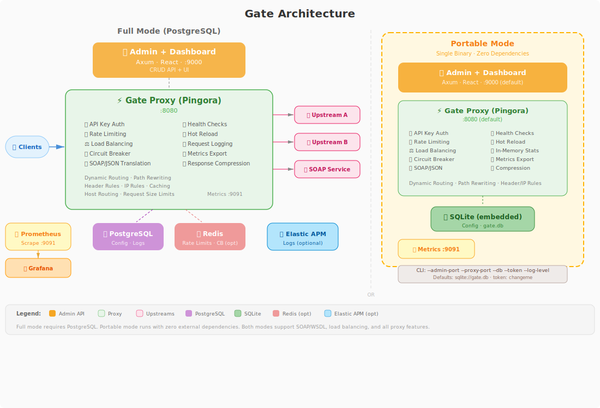

<p align="center">
  
</p>

<h1 align="center">Gate</h1>

<p align="center">
  A high-performance API gateway built with Rust, featuring dynamic routing, load balancing, authentication, rate limiting, SOAP/WSDL support, and an embedded React dashboard.
</p>

<p align="center">
  
  
  
  
  <a href="https://github.com/ssalmutairi/gate/releases/latest"></a>
</p>

<p align="center">
  <strong>Live Demo:</strong> <a href="https://gate.lsa.sa/">gate.lsa.sa</a> (dashboard, token: <code>changeme</code>) · <a href="https://gate-proxy.lsa.sa/">gate-proxy.lsa.sa</a> (proxy)
</p>

## Architecture

<p align="center">
  
</p>

## Features

- **Dynamic Routing** - Configure routes via admin API, changes apply without restart
- **Load Balancing** - Round robin, weighted round robin, and least connections
- **SOAP/WSDL Support** - Import WSDL services and proxy them as JSON APIs with automatic JSON-to-SOAP and SOAP-to-JSON translation
- **API Key Auth** - SHA-256 hashed keys with scoping, expiry, and revocation
- **Rate Limiting** - Per-route sliding window rate limits by IP or API key
- **Health Checks** - Automatic upstream target health monitoring
- **Hot Reload** - Config changes polled from DB every N seconds
- **Prometheus Metrics** - Request counters, latency histograms, health gauges
- **Request Logging** - Async batched logging to PostgreSQL or Elastic APM
- **Circuit Breaker** - Per-target failure tracking with configurable thresholds, half-open recovery, and optional Redis sync
- **Embedded Dashboard** - React UI compiled into the admin binary, served on the same port
- **OpenAPI Schema Viewer** - Resolved request/response schemas with interactive "Try It" panel for testing endpoints directly from the dashboard
- **Service Import** - Import OpenAPI/Swagger specs or WSDL files via URL, file upload, or paste
- **Redis State Backend** - Optional distributed rate limiting and circuit breaker sync for multi-instance deployments
- **Portable Mode** - Single binary with embedded SQLite — zero external dependencies, no PostgreSQL or Redis required
- **Kubernetes Ready** - Helm chart and plain YAML manifests with PostgreSQL and Redis
- **Cross-Platform Binaries** - Precompiled releases for Linux and macOS (x86_64 + aarch64)
- **Docker Compose** - One-command deployment of the full stack

## Lightweight Editions

Simpler, single-purpose API gateways with the same PROXY env var interface — pick the one that fits your stack:

| Edition | Language | Docker Image | Memory | Startup |
|---------|----------|-------------|--------|---------|
| [gate-rust](gate-rust/) | Rust (Axum) | 15 MB | ~7 MB | ~1 ms |
| [gate-deno](gate-deno/) | TypeScript (Deno) | 118 MB | ~30 MB | ~50 ms |
| [gate-java](gate-java/) | Java 21 (Spring WebFlux) | 231 MB | ~150 MB | ~3-5s |

All three support path-based routing, per-service API key auth, TLS upstreams, host override, configurable timeouts, SOAP proxying, and Kubernetes deployment.

## SOAP/WSDL Support

Gate can act as a JSON-to-SOAP gateway. Import any WSDL service and clients interact with it using plain JSON — Gate handles the XML translation transparently.

### How It Works

1. **Import a WSDL** via the dashboard or admin API
2. Gate parses the WSDL, extracts all operations, and creates a route per operation
3. Clients send JSON `POST` requests to `/service-name/OperationName`
4. Gate converts the JSON body to a SOAP XML envelope with the correct SOAPAction header
5. The SOAP XML response is converted back to JSON and returned to the client

### Example

```bash
# Import a WSDL service
curl -X POST http://localhost:9000/admin/services/import \
  -H "Content-Type: application/json" \
  -H "X-Admin-Token: changeme" \
  -d '{"url": "http://www.dneonline.com/calculator.asmx?WSDL", "namespace": "Calculator"}'

# Call a SOAP operation with JSON (after config reload)
curl -X POST http://localhost:8080/calculator/Add \
  -H "Content-Type: application/json" \
  -d '{"intA": 5, "intB": 3}'

# Response (JSON):
# {"AddResult": 8}
```

### Supported WSDL Features

- WSDL 1.1 documents
- Multiple operations per service
- Automatic SOAPAction header injection
- JSON request/response body translation
- SOAP fault handling with error body capture

## Elastic APM Integration

Gate can send request logs to Elastic APM instead of PostgreSQL, offloading log storage to a purpose-built observability system.

### Configuration

```bash
ELASTIC_APM_ENABLED=true
ELASTIC_APM_URL=http://localhost:8200
ELASTIC_APM_TOKEN=your-secret-token  # optional
```

When enabled, PostgreSQL request logging is disabled entirely. Gate sends NDJSON batches to the APM Intake V2 API with:

- **Transaction events** for every request (method, path, status, latency, upstream target)
- **Error events** for failed requests (status >= 400) with upstream response body (up to 4 KB)
- HTML error pages are automatically stripped to plain text for readability in Kibana

## Quick Start

### Portable Mode (Easiest)

A single binary with embedded SQLite — no PostgreSQL, no Redis, no external dependencies.

```bash
# Build and run
cargo run --bin portable

# Or with Docker
docker run -p 8080:8080 -p 9000:9000 -v gate-data:/data gate:latest /usr/local/bin/gate-portable
```

Open http://localhost:9000 for the dashboard. Proxy runs on :8080. Data persists in `gate.db`.

#### CLI Options

```bash
gate-portable [OPTIONS]

Options:
  -a, --admin-port <PORT>      Admin API port [default: 9000]
  -p, --proxy-port <PORT>      Proxy port [default: 8080]
  -m, --metrics-port <PORT>    Metrics port [default: 9091]
  -d, --db <PATH>              SQLite database path [default: sqlite://gate.db]
  -t, --token <TOKEN>          Admin token [default: changeme]
  -l, --log-level <LEVEL>      Log level: trace, debug, info, warn, error [default: info]
```

Example with custom ports:

```bash
gate-portable --admin-port 9100 --proxy-port 9200
```

### Install (Linux / macOS)

```bash
curl -fsSL https://raw.githubusercontent.com/ssalmutairi/gate/main/install.sh | bash
```

Or download a specific version:

```bash
VERSION=v1.8.0 curl -fsSL https://raw.githubusercontent.com/ssalmutairi/gate/main/install.sh | bash
```

This installs `gate-proxy`, `gate-admin`, and `gate-portable` to `/usr/local/bin`. Run `gate-portable` for zero-config portable mode, or set `DATABASE_URL` and run `gate-admin` + `gate-proxy` for full mode with PostgreSQL.

### Docker Compose

```bash
docker compose up -d
```

| Service | Port | Description |
|---------|------|-------------|
| PostgreSQL | 5432 | Database (auto-migrated) |
| Gateway | 8080 | Reverse proxy |
| Gateway | 9000 | Admin API + Dashboard UI |
| Gateway | 9091 | Prometheus metrics |
| Prometheus | 9090 | Metrics collection |
| Grafana | 3001 | Dashboards (admin/admin) |

Open http://localhost:9000 to access the dashboard.

### Manual Development Setup

#### Prerequisites

- Rust (1.86+)
- Node.js (20+)
- Docker (for PostgreSQL — not needed for portable mode)

#### 1. Start PostgreSQL

```bash
docker compose up -d postgres
```

#### 2. Configure Environment

```bash
cp .env.example .env
# Edit .env if needed (defaults work for local development)
```

#### 3. Run the Gateway

```bash
# Terminal 1: Admin API
cargo run --bin admin

# Terminal 2: Proxy
cargo run --bin proxy
```

#### 4. Build & Embed the Dashboard

```bash
cd dashboard && npm install && npm run build && cd ..
```

The admin binary embeds the dashboard at compile time. After building, open http://localhost:9000 to access both the API and the dashboard UI.

### Test the Proxy

```bash
# Create an upstream
curl -X POST http://localhost:9000/admin/upstreams \
  -H "Content-Type: application/json" \
  -H "X-Admin-Token: changeme" \
  -d '{"name": "httpbin", "algorithm": "round_robin"}'

# Add a target (replace <upstream_id> with the id from above)
curl -X POST http://localhost:9000/admin/upstreams/<upstream_id>/targets \
  -H "Content-Type: application/json" \
  -H "X-Admin-Token: changeme" \
  -d '{"host": "httpbin.org", "port": 80}'

# Create a route
curl -X POST http://localhost:9000/admin/routes \
  -H "Content-Type: application/json" \
  -H "X-Admin-Token: changeme" \
  -d '{"name": "test", "path_prefix": "/api", "upstream_id": "<upstream_id>", "strip_prefix": true}'

# Test the proxy (wait a few seconds for config reload)
curl http://localhost:8080/api/get
```

## Configuration

| Variable | Default | Description |
|----------|---------|-------------|
| `DATABASE_URL` | (required) | PostgreSQL connection string (portable default: `sqlite://gate.db`) |
| `PROXY_PORT` | `8080` | Proxy listening port |
| `ADMIN_PORT` | `9000` | Admin API listening port |
| `ADMIN_BIND_ADDR` | `127.0.0.1` | Admin API bind address |
| `ADMIN_TOKEN` | (none) | Admin API authentication token (portable default: `changeme`) |
| `LOG_LEVEL` | `info` | Log level (trace, debug, info, warn, error) |
| `CONFIG_POLL_INTERVAL_SECS` | `5` | Config reload interval |
| `HEALTH_CHECK_INTERVAL_SECS` | `10` | Health check interval |
| `HEALTH_CHECK_PATH` | `/health` | Health check endpoint path |
| `METRICS_PORT` | `9091` | Prometheus metrics port |
| `TRUSTED_PROXIES` | (none) | Comma-separated trusted proxy CIDRs for X-Forwarded-For |
| `REDIS_URL` | (none) | Redis URL for distributed state (enables Redis backend) |
| `REDIS_POOL_SIZE` | `8` | Redis connection pool size |
| `ELASTIC_APM_ENABLED` | `false` | Enable Elastic APM logging (replaces PostgreSQL logging) |
| `ELASTIC_APM_URL` | (none) | Elastic APM server URL (required when APM enabled) |
| `ELASTIC_APM_TOKEN` | (none) | Bearer token for Elastic APM authentication |
| `MAX_SPEC_SIZE_MB` | `25` | Maximum spec file size for service import |

## Admin API

| Method | Path | Description |
|--------|------|-------------|
| GET | `/admin/health` | Health check |
| GET | `/admin/stats` | Aggregated statistics |
| GET | `/admin/logs` | Request logs (paginated) |
| GET/POST | `/admin/routes` | List/create routes |
| GET/PUT/DELETE | `/admin/routes/:id` | Get/update/delete route |
| GET/POST | `/admin/upstreams` | List/create upstreams |
| GET/PUT/DELETE | `/admin/upstreams/:id` | Get/update/delete upstream |
| POST | `/admin/upstreams/:id/targets` | Add target |
| DELETE | `/admin/upstreams/:id/targets/:tid` | Remove target |
| GET/POST | `/admin/api-keys` | List/create API keys |
| PUT/DELETE | `/admin/api-keys/:id` | Update/delete API key |
| GET/POST | `/admin/rate-limits` | List/create rate limits |
| PUT/DELETE | `/admin/rate-limits/:id` | Update/delete rate limit |
| GET/POST | `/admin/services` | List services / import OpenAPI or WSDL |
| GET/PUT/DELETE | `/admin/services/:id` | Get/update/delete service |
| GET | `/admin/services/:id/spec` | Get stored spec (OpenAPI JSON or WSDL XML) |

## Observability

- **Prometheus**: Metrics available at `http://localhost:9091/metrics`
- **Grafana**: Access at `http://localhost:3001` (admin/admin)
- **Request Logs**: Stored in PostgreSQL or Elastic APM, queryable via `/admin/logs` (PostgreSQL) or Kibana APM UI (Elastic)

Metrics exposed:
- `gateway_requests_total` - Request count by method, route, status
- `gateway_request_duration_seconds` - Latency histogram
- `gateway_upstream_errors_total` - Upstream connection failures
- `gateway_rate_limit_hits_total` - Rate limit rejections
- `gateway_auth_failures_total` - Authentication failures
- `gateway_active_connections` - Current active connections
- `gateway_upstream_health` - Target health status (1=healthy, 0=unhealthy)
- `gateway_state_backend_redis` - State backend type (1=Redis, 0=Memory)

## Testing

```bash
# Standalone tests (24 tests, no external dependencies)
cargo test -p portable

# Shared library tests (7 tests)
cargo test -p shared

# All Rust tests (requires PostgreSQL for admin/proxy integration tests)
cargo test --workspace -- --test-threads=1

# E2E tests (10 scenarios, requires PostgreSQL + built binaries)
bash tests/e2e/run.sh

# Dashboard tests (45 tests)
cd dashboard && npm test

# Combined coverage report (unit + E2E)
bash scripts/coverage.sh
```

### Test Summary

| Component | Tests | Requires |
|-----------|-------|----------|
| portable (unit + e2e) | 27 | Nothing (in-memory SQLite) |
| shared | 7 | Nothing |
| admin (unit) | 37 | Nothing |
| admin (integration) | 65 | PostgreSQL |
| proxy | 120 | PostgreSQL |
| dashboard | 45 | Nothing |
| e2e (bash) | 10 | PostgreSQL + built binaries |
| **Total** | **311** | |

## Project Structure

```
gate/
  crates/
    proxy/       - Pingora-based reverse proxy (SOAP/JSON translation, Elastic APM)
    admin/       - Axum admin API server (WSDL parser, service import)
    portable/  - Single binary with embedded SQLite (admin + proxy, no external deps)
    shared/      - Shared models and configuration
  dashboard/     - React frontend (Vite + TailwindCSS)
  migrations/    - SQL migration files (PostgreSQL)
  charts/        - Helm chart for Kubernetes deployment
  deploy/        - Plain Kubernetes YAML manifests
  prometheus/    - Prometheus configuration
  grafana/       - Grafana dashboards and provisioning
```

## Tech Stack

- **Proxy**: [Pingora](https://github.com/cloudflare/pingora) (Cloudflare's Rust proxy framework)
- **Admin API**: [Axum](https://github.com/tokio-rs/axum) with SQLx
- **Database**: PostgreSQL 16 (full mode) or SQLite (portable mode)
- **Dashboard**: React 19 + Vite + TailwindCSS v4 + TanStack Query
- **Metrics**: Prometheus + Grafana
- **APM**: Elastic APM (optional)
- **State**: In-memory or Redis (optional)
- **XML**: quick-xml for SOAP/WSDL parsing

## License

Apache-2.0
