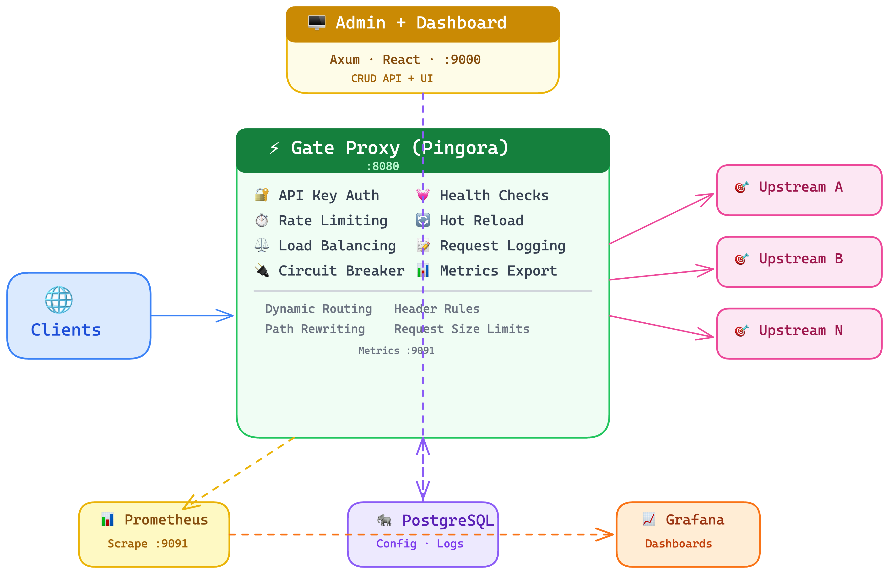

<p align="center">
  
</p>

<h1 align="center">Gate</h1>

<p align="center">
  A high-performance API gateway built with Rust, featuring dynamic routing, load balancing, authentication, rate limiting, and an embedded React dashboard.
</p>

<p align="center">
  
  
  
  
  <a href="https://github.com/ssalmutairi/gate/releases/latest"></a>
</p>

<p align="center">
  <strong>Live Demo:</strong> <a href="https://gate.lsa.sa/">gate.lsa.sa</a> (dashboard, token: <code>changeme</code>) · <a href="https://gate-proxy.lsa.sa/">gate-proxy.lsa.sa</a> (proxy)
</p>

## Architecture

<p align="center">
  
</p>

## Features

- **Dynamic Routing** - Configure routes via admin API, changes apply without restart
- **Load Balancing** - Round robin, weighted round robin, and least connections
- **API Key Auth** - SHA-256 hashed keys with scoping, expiry, and revocation
- **Rate Limiting** - Per-route sliding window rate limits by IP or API key
- **Health Checks** - Automatic upstream target health monitoring
- **Hot Reload** - Config changes polled from DB every N seconds
- **Prometheus Metrics** - Request counters, latency histograms, health gauges
- **Request Logging** - Async batched logging to PostgreSQL
- **Embedded Dashboard** - React UI compiled into the admin binary, served on the same port
- **Cross-Platform Binaries** - Precompiled releases for Linux and macOS (x86_64 + aarch64)
- **Docker Compose** - One-command deployment of the full stack

## Quick Start

### Install (Linux / macOS)

```bash
curl -fsSL https://raw.githubusercontent.com/ssalmutairi/gate/main/install.sh | bash
```

Or download a specific version:

```bash
VERSION=v1.3.0 curl -fsSL https://raw.githubusercontent.com/ssalmutairi/gate/main/install.sh | bash
```

This installs `gate-proxy` and `gate-admin` to `/usr/local/bin`. Set `DATABASE_URL` and run `gate-admin` to get started — the dashboard is available at `http://localhost:9000`.

### Docker Compose

```bash
docker compose up -d
```

| Service | Port | Description |
|---------|------|-------------|
| PostgreSQL | 5432 | Database (auto-migrated) |
| Gateway | 8080 | Reverse proxy |
| Gateway | 9000 | Admin API + Dashboard UI |
| Gateway | 9091 | Prometheus metrics |
| Prometheus | 9090 | Metrics collection |
| Grafana | 3001 | Dashboards (admin/admin) |

Open http://localhost:9000 to access the dashboard.

### Manual Development Setup

#### Prerequisites

- Rust (1.93+)
- Node.js (20+)
- Docker (for PostgreSQL)

#### 1. Start PostgreSQL

```bash
docker compose up -d postgres
```

#### 2. Configure Environment

```bash
cp .env.example .env
# Edit .env if needed (defaults work for local development)
```

#### 3. Run the Gateway

```bash
# Terminal 1: Admin API
cargo run --bin admin

# Terminal 2: Proxy
cargo run --bin proxy
```

#### 4. Build & Embed the Dashboard

```bash
cd dashboard && npm install && npm run build && cd ..
```

The admin binary embeds the dashboard at compile time. After building, open http://localhost:9000 to access both the API and the dashboard UI.

### Test the Proxy

```bash
# Create an upstream
curl -X POST http://localhost:9000/admin/upstreams \
  -H "Content-Type: application/json" \
  -H "X-Admin-Token: changeme" \
  -d '{"name": "httpbin", "algorithm": "round_robin"}'

# Add a target (replace <upstream_id> with the id from above)
curl -X POST http://localhost:9000/admin/upstreams/<upstream_id>/targets \
  -H "Content-Type: application/json" \
  -H "X-Admin-Token: changeme" \
  -d '{"host": "httpbin.org", "port": 80}'

# Create a route
curl -X POST http://localhost:9000/admin/routes \
  -H "Content-Type: application/json" \
  -H "X-Admin-Token: changeme" \
  -d '{"name": "test", "path_prefix": "/api", "upstream_id": "<upstream_id>", "strip_prefix": true}'

# Test the proxy (wait a few seconds for config reload)
curl http://localhost:8080/api/get
```

## Configuration

| Variable | Default | Description |
|----------|---------|-------------|
| `DATABASE_URL` | (required) | PostgreSQL connection string |
| `PROXY_PORT` | `8080` | Proxy listening port |
| `ADMIN_PORT` | `9000` | Admin API listening port |
| `ADMIN_BIND_ADDR` | `127.0.0.1` | Admin API bind address |
| `ADMIN_TOKEN` | (none) | Admin API authentication token |
| `LOG_LEVEL` | `info` | Log level (trace, debug, info, warn, error) |
| `CONFIG_POLL_INTERVAL_SECS` | `5` | Config reload interval |
| `HEALTH_CHECK_INTERVAL_SECS` | `10` | Health check interval |
| `HEALTH_CHECK_PATH` | `/health` | Health check endpoint path |
| `METRICS_PORT` | `9091` | Prometheus metrics port |
| `TRUSTED_PROXIES` | (none) | Comma-separated trusted proxy CIDRs for X-Forwarded-For |

## Admin API

| Method | Path | Description |
|--------|------|-------------|
| GET | `/admin/health` | Health check |
| GET | `/admin/stats` | Aggregated statistics |
| GET | `/admin/logs` | Request logs (paginated) |
| GET/POST | `/admin/routes` | List/create routes |
| GET/PUT/DELETE | `/admin/routes/:id` | Get/update/delete route |
| GET/POST | `/admin/upstreams` | List/create upstreams |
| GET/PUT/DELETE | `/admin/upstreams/:id` | Get/update/delete upstream |
| POST | `/admin/upstreams/:id/targets` | Add target |
| DELETE | `/admin/upstreams/:id/targets/:tid` | Remove target |
| GET/POST | `/admin/api-keys` | List/create API keys |
| PUT/DELETE | `/admin/api-keys/:id` | Update/delete API key |
| GET/POST | `/admin/rate-limits` | List/create rate limits |
| PUT/DELETE | `/admin/rate-limits/:id` | Update/delete rate limit |

## Observability

- **Prometheus**: Metrics available at `http://localhost:9091/metrics`
- **Grafana**: Access at `http://localhost:3001` (admin/admin)
- **Request Logs**: Stored in PostgreSQL, queryable via `/admin/logs`

Metrics exposed:
- `gateway_requests_total` - Request count by method, route, status
- `gateway_request_duration_seconds` - Latency histogram
- `gateway_upstream_errors_total` - Upstream connection failures
- `gateway_rate_limit_hits_total` - Rate limit rejections
- `gateway_auth_failures_total` - Authentication failures
- `gateway_active_connections` - Current active connections
- `gateway_upstream_health` - Target health status (1=healthy, 0=unhealthy)

## Testing

```bash
# All Rust tests (96 unit + integration tests, requires PostgreSQL)
cargo test --workspace -- --test-threads=1

# E2E tests (9 scenarios, requires PostgreSQL + built binaries)
bash tests/e2e/run.sh

# Dashboard tests
cd dashboard && npm test

# Combined coverage report (unit + E2E)
bash scripts/coverage.sh
```

### Coverage

Combined unit + integration + E2E coverage via `cargo-llvm-cov`:

| Component | Lines | Functions |
|-----------|-------|-----------|
| **Overall** | **92.0%** | **89.5%** |
| `router.rs` | 100% | 100% |
| `lb.rs` | 99.1% | 100% |
| `proxy/main.rs` | 98.9% | 100% |
| `admin/main.rs` | 98.3% | 100% |
| `api_keys.rs` | 97.0% | 81.8% |
| `logging.rs` | 96.4% | 100% |
| `proxy/config.rs` | 96.6% | 100% |
| `routes.rs` | 96.5% | 84.6% |
| `rate_limits.rs` | 95.5% | 100% |
| `shared/config.rs` | 94.9% | 66.7% |
| `service.rs` | 94.4% | 84.2% |
| `upstreams.rs` | 93.1% | 89.5% |
| `header_rules.rs` | 93.6% | 88.9% |
| `errors.rs` | 91.5% | 100% |
| `services.rs` | 85.2% | 83.6% |
| `metrics.rs` | 85.7% | 88.9% |

## Project Structure

```
gate/
  crates/
    proxy/     - Pingora-based reverse proxy
    admin/     - Axum admin API server
    shared/    - Shared models and configuration
  dashboard/   - React frontend (Vite + TailwindCSS)
  migrations/  - SQL migration files
  prometheus/  - Prometheus configuration
  grafana/     - Grafana dashboards and provisioning
```

## Tech Stack

- **Proxy**: [Pingora](https://github.com/cloudflare/pingora) (Cloudflare's Rust proxy framework)
- **Admin API**: [Axum](https://github.com/tokio-rs/axum) with SQLx
- **Database**: PostgreSQL 16
- **Dashboard**: React 19 + Vite + TailwindCSS v4 + TanStack Query
- **Metrics**: Prometheus + Grafana

## License

Apache-2.0
